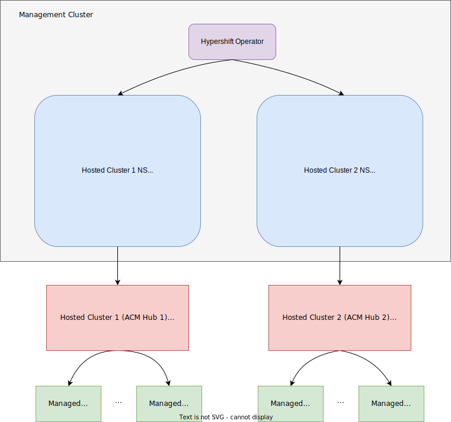

# hyper-acm-deploy
Customize ACM components on a Hypershift hosted cluster with zero worker node based on the given configuration file.

## Prereqs
At least three running k8s clusters are required:
- Management cluster
- Hosted cluster with zero worker node provisioned by Hypershift
- Managed cluster

### Diagram


### A k8s cluster runs as the `management cluster`

### A `hosted cluster` provisioned by Hypershift

The hosted cluster is running on hosted cluster namespace of the management cluster.

#### Create a hosted cluster with zero worker node

1. Build hypershift binary via checking out the corresponding branch of the hypershift git repo

e.g. If you want to create a hosted cluster with OCP V4.10, you have to check out the release-4.10 branch
```
% git clone https://github.com/openshift/hypershift.git
% git checkout release-4.10
% make build
```

Note: Currently hypershift failed to create hosted cluster with OCP V4.9. The kube-apiserver (KAS) pod failed to start with the following error
```
Error: failed to initialize admission: couldn't init admission plugin "PodSecurity": no kind "PodSecurityConfiguration" is registered for version "pod-security.admission.config.k8s.io/v1beta1" in scheme "k8s.io/pod-security-admission/admission/api/scheme/scheme.go:29"
```

2. Install the hypershift operator. By default, it is installed on the `hypershift` NS. Make sure the hypershift operator running
```
% ./bin/hypershift install --hypershift-image quay.io/hypershift/hypershift-operator:4.10
% oc get pods -n hypershift
NAME                        READY   STATUS    RESTARTS   AGE
operator-567b4b469b-shw59   1/1     Running   0          66s
```
3. Create a hosted cluster with zero worker node
```
% oc create namespace hypershift-clusters

// copy ocp global pull secret to hypershift-clusters namespace
% pull_secret=$(mktemp /tmp/pull-secret.XXXXXX)
% oc get secret -n openshift-config pull-secret -o jsonpath={.data.\\\.dockerconfigjson} | base64 -d > $pull_secret
% oc create secret docker-registry -n hypershift-clusters pull-secret --from-file=.dockerconfigjson=$pull_secret
% rm -rf $pull_secret

% oc apply -f https://raw.githubusercontent.com/xiangjingli/hyper-acm-deploy/main/hypershift/hypershift-controlplane.yaml
```

4. Check the hosted cluster CR status.
```
% oc get hostedclusters -A
NAMESPACE             NAME    VERSION   KUBECONFIG               PROGRESS   AVAILABLE   REASON                    MESSAGE
hypershift-clusters   acm-1             acm-1-admin-kubeconfig   Partial    True        HostedClusterAsExpected   
```

5. Check the status of the hosted cluster control plane. In particular, the `kube-apiserver` has to be in running status
```
% oc get pods -n hypershift-clusters-acm-1
NAME                                              READY   STATUS    RESTARTS   AGE
catalog-operator-6759b54db7-r8652                 2/2     Running   0          3m21s
certified-operators-catalog-6cc8cbd6f5-fjpv8      1/1     Running   0          3m22s
cluster-api-78f5b54ffd-k6p44                      1/1     Running   0          4m1s
cluster-autoscaler-6c6474d4d6-28sdz               1/1     Running   0          3m7s
cluster-policy-controller-6c75fdd846-chxj7        1/1     Running   0          3m23s
cluster-version-operator-7bf4876775-j7m9p         1/1     Running   0          3m23s
community-operators-catalog-799bd4f47-lz8rs       1/1     Running   0          3m22s
control-plane-operator-7fdd56d95-k4xf6            1/1     Running   0          4m
etcd-0                                            1/1     Running   0          3m24s
hosted-cluster-config-operator-57c9695f96-wxz7t   1/1     Running   0          3m22s
ignition-server-5c9c4d6f89-nhghm                  1/1     Running   0          3m58s
ingress-operator-78db47bb5c-hxp4v                 2/2     Running   0          3m22s
konnectivity-agent-cc87cbd5b-xs8gj                1/1     Running   0          3m24s
konnectivity-server-7c6d684f98-c82vf              1/1     Running   0          3m24s
kube-apiserver-5646dc7b7d-2vzk2                   2/2     Running   0          3m23s  // key components
kube-controller-manager-cfdb6bf65-2qtmj           1/1     Running   0          3m23s
kube-scheduler-6bcf5669f4-ktxlp                   1/1     Running   0          3m23s
machine-approver-67f59d577b-h4gxt                 1/1     Running   0          3m7s
oauth-openshift-55db9cd748-89psb                  1/1     Running   0          93s
olm-operator-5b44f9d49c-vhwmb                     2/2     Running   0          3m21s
openshift-apiserver-7dcb954b74-92fnn              2/2     Running   0          3m23s
openshift-controller-manager-665496d546-jq8s6     1/1     Running   0          3m23s
openshift-oauth-apiserver-555fd58b9f-f2mwl        1/1     Running   0          3m23s
packageserver-7974b69c9c-nn22k                    2/2     Running   0          3m21s
redhat-marketplace-catalog-fbf5f8d65-6n9ck        1/1     Running   0          3m22s
redhat-operators-catalog-74cc468978-x6bhx         1/1     Running   0          3m22s
```

#### Verify and access the hosted cluster

1. Check the hostedCluster CR status
e.g.
Hosted Cluster Namespace = hypershift-clusters
Hosted Cluster Name = acm-1
```
% CLUSTER_NAMESPACE=hypershift-clusters
% CLUSTER_NAME=acm-1
% oc get hostedclusters -n ${CLUSTER_NAMESPACE} ${CLUSTER_NAME}
```

2. Access the hosted cluster
```
% HOSTED_CLUSTER_KUBECONFIG=`oc get hostedcluster -n ${CLUSTER_NAMESPACE} ${CLUSTER_NAME} -o jsonpath={.status.kubeconfig.name}`
% oc get secret -n ${CLUSTER_NAMESPACE} ${HOSTED_CLUSTER_KUBECONFIG} -o jsonpath={.data.kubeconfig} | base64 -d > ${HOSTED_CLUSTER_KUBECONFIG}.kubeconfig
% export KUBECONFIG=${HOSTED_CLUSTER_KUBECONFIG}.kubeconfig
% oc cluster-info
```

3. Make sure the hosted cluster is zero worker node
```
% oc get nodes
No resources found
```

#### Uninstall the hosted cluster
```
% oc delete hostedclusters -n hypershift-clusters   acm-1

% oc delete ns hypershift-clusters

% oc delete all -n hypershift --all

% oc delete ns hypershift

% oc delete PriorityClass hypershift-api-critical hypershift-control-plane  hypershift-etcd   hypershift-operator
```

### A k8s cluster run as the `managed clusters`

The clusters will be imported to the ACM hub via `import-cluster.sh`.

## Create Configuration file acm.conf

Please check the configuration file sample [acm.conf](acm.conf), where

- You can choose which ACM components (App, Policy, Observability) to be installed. The ACM foundation component is always installed by default.
- You can specify images for each component


## Install ACM Hub on a Hypershift hosted cluster
```
% export KUBECONFIG=<management cluster kubeconfig>
% ./hyper-acm-install.sh -f <configuration file name> -n <Hosted cluster Namespace> -c <Hosted cluster Name>
```

## Uninstall ACM Hub from a Hypershift hosted cluster
```
% export KUBECONFIG=<management cluster kubeconfig>
% ./hyper-acm-uninstall.sh -n <Hosted cluster Namespace> -c <Hosted cluster Name>
```

## Import a managed cluster to the ACM hub
```
% export KUBECONFIG=<management cluster kubeconfig>
% ./import-cluster.sh -f <configuration file name> -n <Hosted cluster Namespace> -c <Hosted cluster Name> -m <the managed cluster name> -k <the managed cluster kubeconfig>
```
## Detach a managed cluster from the ACM hub
```
% export KUBECONFIG=<management cluster kubeconfig>
% ./detach-cluster.sh -n <Hosted cluster Namespace> -c <Hosted cluster Name> -m <the managed cluster name> -k <the managed cluster kubeconfig>
```
## Run E2E tests on hosted clusters

### 1. Deploy a guestbook app to the managed cluster

- Deploy the app manifest on the hosted cluster
```
% export KUBECONFIG=<hosted cluster kubeconfig>
% oc apply -f app/hosted/test/test-4-appsub-git-e2e.yaml
```

- Check the app deployed on the managed cluster
```
% export KUBECONFIG=<managed cluster kubeconfig>
% oc get pods -n test-appsub-4-ns
NAME                           READY   STATUS    RESTARTS   AGE
frontend-6c6d6dfd4d-4zctw      1/1     Running   0          3m22s
frontend-6c6d6dfd4d-6lh82      1/1     Running   0          3m22s
frontend-6c6d6dfd4d-pjq64      1/1     Running   0          3m22s
redis-master-f46ff57fd-zgwfp   1/1     Running   0          3m22s
redis-slave-7979cfdfb8-fvmjn   1/1     Running   0          3m22s
redis-slave-7979cfdfb8-x6c8j   1/1     Running   0          3m22s
```

### 2. Deploy a policy to the managed cluster

- Deploy the policy manifest on the hosted cluster
```
% export KUBECONFIG=<hosted cluster kubeconfig>
% oc apply -f policy/hosted/test/test-policy.yaml
```

- Check the policy deployed on the managed cluster
```
% export KUBECONFIG=<managed cluster kubeconfig>
% oc get policy -A
NAMESPACE   NAME                 REMEDIATION ACTION   COMPLIANCE STATE   AGE
cluster1    default.policy-pod   inform               NonCompliant       13s
```
